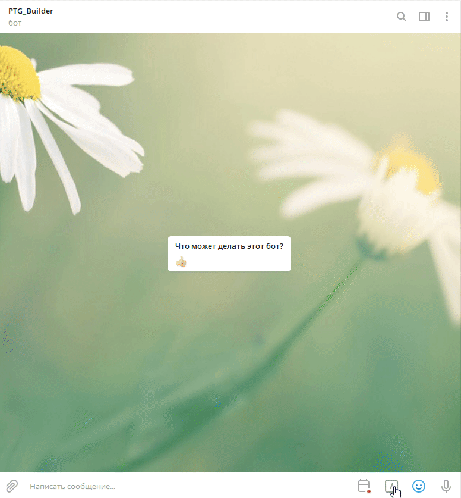

# TelegramBot
Телеграм бот взаимодействует с 1C:Fresh, отправляет в него cf, cfe, планирует обновление нод

Боту можно устанавливать пароль, установка осуществляется через параметр -SetPass. Сессия длится час, для сессии используется Redis.
Актуальная версия Redis для windows лежит [тут](https://github.com/MicrosoftArchive/redis/releases)

## Команды бота
**buildcfe** - Собрать файлы расширений *.cfe

**buildcf** - Собрать файл конфигурации *.cf

**deployextension** - Отправка файла в МС, инкремент версии в ветки Dev, отправка задания на обновление в jenkins

**buildanduploadcf** - Собрать конфигурацию и отправить в менеджер сервиса

**buildanduploadcfe** - Собрать Файлы расширений и обновить в менеджер сервиса

**setplanupdate** - Запланировать обновление

**getlistupdatestate** - Получить список запланированных обновлений конфигураций

**invokeupdate** - Запуск задания jenkins для принудительного старта обработчиков обновления

**disablezabbixmonitoring** - Отключение zabbix мониторинга

**charts** - Графики

## Gif

